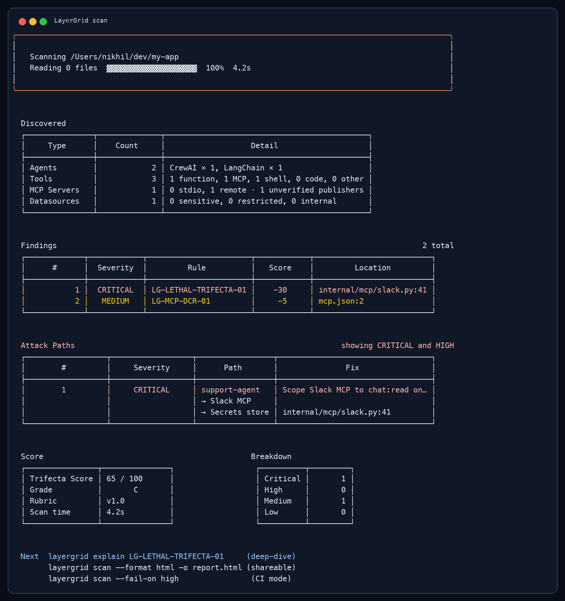

# LayerGrid CLI

[](https://github.com/layergrid/layergrid-cli/releases)
[](docs/RELEASE.md)
[](LICENSE)
[](https://github.com/layergrid/layergrid-cli/actions/workflows/ci.yaml)

LayerGrid is an offline static scanner for AI agent stacks. It discovers agents, tools, MCP servers, and risky capability composition, then reports a deterministic Trifecta Score.



## Install

Homebrew:

```sh
brew install layergrid/tap/layergrid
```

curl (macOS and Linux):

```sh
curl -sSL https://layergrid.github.io/layergrid-cli/install.sh | bash
```

Go:

```sh
go install github.com/layergrid/layergrid-cli/cmd/layergrid@latest
```

## Status

Pre-release candidate work. The scanner is local-only and has no cloud dependency or telemetry.

Public Trifecta Score reports and leaderboard: [trifecta.report](https://trifecta.report) (coming soon).

## Quick Start

```sh
go run ./cmd/layergrid scan .
go run ./cmd/layergrid list-rules
go run ./cmd/layergrid explain LG-LETHAL-TRIFECTA-01
```

## Example

```sh
layergrid scan . --fail-on high
layergrid scan . --format json --output layergrid.json
layergrid scan . --format sarif --output layergrid.sarif
```

## Docs

- [Engineering principles](docs/PRINCIPLES.md)
- [Rules](docs/RULES.md)
- [Precision report](docs/PRECISION.md)
- [Benchmarks](docs/BENCHMARKS.md)
- [Release process](docs/RELEASE.md)
- [Release readiness](docs/release-readiness.md)
- [Contributing](docs/CONTRIBUTING.md)

Marketing site: [layergrid.ai](https://layergrid.ai)

## License

Apache-2.0.
